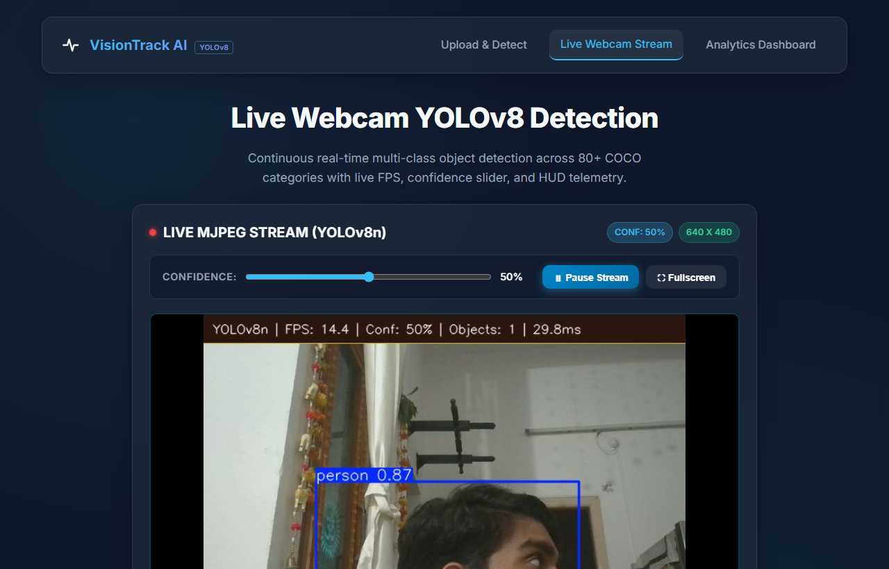

# Real-Time Object Detection & Analytics System (YOLOv8 Multi-Class Edition)

[](https://www.python.org/)
[](https://flask.palletsprojects.com/)
[](https://github.com/ultralytics/ultralytics)
[](https://opencv.org/)
[](https://sqlite.org/)
[](https://pytest.org/)

A production-grade, modular computer vision web application and RESTful API built with **Python, YOLOv8 (Ultralytics, `yolov8n.pt`), Flask, SQLite, and modern JavaScript/CSS3**.

The system performs multi-class object detection across **80+ everyday categories** (phone, chair, person, TV, mouse, bottle, dog, car, laptop, etc.), allows dynamic **confidence threshold tuning** via a frontend slider, logs per-detection spatial telemetry into SQLite with full CRUD capabilities, and features an interactive Chart.js analytics dashboard.

---

## 📸 Application Preview & Screenshots

### 1. Main Detection & Upload Interface (with Confidence Slider)
> Drag-and-drop file upload interface with real-time confidence threshold control (10% to 90%), live image preview, and multi-class YOLOv8 bounding box predictions.


---

### 2. Live Webcam Stream & Real-Time MJPEG Telemetry
> High-framerate real-time video streaming over `multipart/x-mixed-replace` with on-the-fly YOLOv8 multi-class inference, live FPS overlay, confidence tuning, and simulated fallback feed.


---

### 3. Side-by-Side Result & Coordinate Telemetry Inspector
> High-resolution side-by-side comparison (Original Source vs Annotated Output), per-object detection table (class label, confidence score, bounding box `[x1, y1, x2, y2]`), and raw JSON export.


---

### 4. Analytics & Performance Dashboard
> Real-time system telemetry with KPI summary cards, Top 10 detected object classes bar chart, inference latency & count trends over time, and interactive SQLite history table with CRUD deletion.


---

## 🌟 Key Features

- **80+ Category Multi-Class Detection**: Powered by Ultralytics YOLOv8 (`yolov8n.pt`) pre-trained on the MS COCO dataset (person, car, dog, bottle, chair, tv, phone, laptop, etc.).
- **Confidence Threshold Control**: Frontend interactive slider allows dynamic confidence filtering from 10% to 90% (default: 50%).
- **High-Performance Latency Telemetry**: Every inference run tracks precision inference execution time in milliseconds (`processing_time_ms`).
- **Strict Input Validation & Security**:
  - File extension verification against whitelist (`PNG`, `JPG`, `JPEG`, `WEBP`)
  - 16MB file payload limit (`MAX_CONTENT_LENGTH`)
  - Image decode integrity checks (`cv2.imread` / OpenCV validation)
  - Standard HTTP status codes (`200`, `400`, `404`, `413`, `415`, `500`)
- **Full CRUD RESTful API**: Complete REST endpoints including `POST /detect`, `GET /api/history`, `GET /api/history/<id>`, and `DELETE /api/history/<id>`.
- **Relational Data Persistence**: SQLite logging with automatic schema creation, indexing, and JSON object telemetry storage.
- **Glassmorphic Responsive UI**: Modern dark theme built with CSS3 variables, drag-and-drop zones, and Chart.js telemetry charts.
- **100% Automated Pytest Coverage**: Comprehensive unit tests for the detection engine and API integration tests.

---

## ⚠️ Notes on Dependencies & Image Formats

> [!NOTE]
> **OpenCV Package Choice (`opencv-python` vs `opencv-python-headless`)**:
> - `opencv-python` is specified in `requirements.txt` for local development and desktop environments.
> - For headless production environments (Docker containers, AWS/GCP servers with no GUI/display server), use `opencv-python-headless` instead.

> [!WARNING]
> **WebP Image Format Compatibility**:
> - WebP (`.webp`) format is supported in validation and upload handling.
> - Please note that detection results may vary depending on lossy compression levels compared to uncompressed JPEG or PNG formats.

---

## 🛠️ Tech Stack

| Layer | Technology |
|---|---|
| **Deep Learning Model** | Ultralytics YOLOv8 Nano (`yolov8n.pt` — 6.2MB) |
| **Backend Framework** | Flask 3.0 (Python) |
| **Computer Vision Engine** | OpenCV (`cv2`) & NumPy |
| **Database** | SQLite 3 (Indexed relational logging) |
| **Frontend UI** | HTML5, Modern CSS3 Glassmorphism, Vanilla JavaScript |
| **Data Visualization** | Chart.js 4.x |
| **Testing Suite** | Pytest, Requests |

---

## 📂 Project Architecture & Directory Structure

```
AI_Object_Detection_System/
├── app.py                     # Flask application & REST API routes (GET, POST, DELETE)
├── detector.py                # OOP ObjectDetector class using Ultralytics YOLOv8
├── database.py                # SQLite module with full CRUD operations & analytics
├── config.py                  # Centralized configuration constants & YOLO model path
├── requirements.txt           # Production dependencies (Flask, Ultralytics, OpenCV, NumPy)
├── requirements-dev.txt       # Development & testing dependencies (Pytest, Requests)
├── .gitignore                 # Excludes static/uploads, database, and weights (*.pt)
├── models/
│   └── yolov8n.pt             # Auto-downloaded on first run (~6MB)
├── static/
│   ├── css/
│   │   └── style.css          # Glassmorphic UI styling
│   ├── js/
│   │   ├── main.js            # Upload logic, confidence slider, bounding box rendering
│   │   └── analytics.js       # Chart.js visualization & asynchronous CRUD actions
│   └── uploads/               # Saved original and annotated result images
├── templates/
│   ├── index.html             # Upload & real-time detection page with confidence slider
│   ├── live.html              # Real-time webcam streaming interface
│   ├── result.html            # Side-by-side inspection & per-detection table
│   └── analytics.html         # Performance metrics & historical CRUD table
├── tests/
│   ├── __init__.py
│   ├── test_detector.py       # Unit tests for YOLOv8 ObjectDetector OOP engine
│   └── test_api.py            # API endpoint integration and validation tests
├── docs/
│   └── screenshots/           # Application screenshots for documentation
└── README.md                  # Complete project documentation
```

---

## 🚀 Installation & Getting Started

### 1. Clone the Repository
```bash
git clone https://github.com/harshithcheripally16-ui/AI_Object_Detection_System.git
cd AI_Object_Detection_System
```

### 2. Set Up a Virtual Environment
```bash
# Windows
python -m venv venv
.\venv\Scripts\activate

# Linux / macOS
python3 -m venv venv
source venv/bin/activate
```

### 3. Install Dependencies
```bash
# Production environment
pip install -r requirements.txt

# Development / Testing environment
pip install -r requirements-dev.txt
```

### 4. Run the Application
```bash
python app.py
```
Open your browser and navigate to:
```
http://127.0.0.1:5000/
```

---

## 🧪 Running Automated Tests

Run the complete test suite using `pytest`:

```bash
pytest -v tests/
```

### Test Suite Summary:
- `tests/test_detector.py`: Tests YOLOv8 model initialization, inference execution, blank image handling, stats structure (`total` & `objects`), confidence cutoff, and bounding box drawing.
- `tests/test_api.py`: Tests `GET /`, `GET /analytics`, `POST /detect` input validation (empty file, invalid extension, required JSON response keys), and `DELETE /api/history/<id>` CRUD lifecycle.

---

## 📡 REST API Reference

### 1. Object Detection Endpoint
`POST /detect`

**Request Headers**: `Content-Type: multipart/form-data`  
**Parameters**:
- `image` (File, Required): Image file (`.png`, `.jpg`, `.jpeg`, `.webp`, Max: 16MB)
- `confidence` (Float, Optional): Confidence threshold from `0.1` to `0.9` (Default: `0.5`)

**Example `200 OK` Response**:
```json
{
  "id": 5,
  "result_image": "/static/uploads/result_abc123.jpg",
  "original_image": "/static/uploads/upload_abc123.jpg",
  "total_count": 4,
  "confidence_used": 0.5,
  "processing_time_ms": 142.3,
  "result_page_url": "/result/5",
  "detections": [
    {"class": "person", "confidence": 0.94, "bbox": [220.0, 105.0, 480.0, 390.0]},
    {"class": "laptop", "confidence": 0.89, "bbox": [190.0, 240.0, 510.0, 410.0]},
    {"class": "cup", "confidence": 0.82, "bbox": [90.0, 305.0, 175.0, 395.0]},
    {"class": "cell phone", "confidence": 0.87, "bbox": [535.0, 325.0, 605.0, 425.0]}
  ]
}
```

**HTTP Status Codes**:
- `200 OK`: Detection successful.
- `400 Bad Request`: Missing file, empty filename, or corrupted image.
- `413 Payload Too Large`: Upload exceeds 16MB.
- `415 Unsupported Media Type`: File extension not allowed.
- `500 Internal Server Error`: Unexpected server or model error.

---

### 2. Analytics Telemetry Feed
`GET /api/analytics-data`

**Response**:
```json
{
  "total_images": 45,
  "total_objects": 118,
  "avg_objects_per_image": 2.62,
  "avg_processing_time_ms": 145.31,
  "top_class": "Person",
  "class_distribution": [
    {"class": "person", "count": 42},
    {"class": "laptop", "count": 25},
    {"class": "cell phone", "count": 18},
    {"class": "chair", "count": 14},
    {"class": "cup", "count": 10}
  ],
  "timeline": [ ... ]
}
```

---

### 3. Historical Detections API
- `GET /api/history`: List recent detection records.
- `GET /api/history/<id>`: Retrieve specific detection by ID.
- `DELETE /api/history/<id>`: Delete record and associated files.

---

## 📄 License
This project is licensed under the MIT License.
