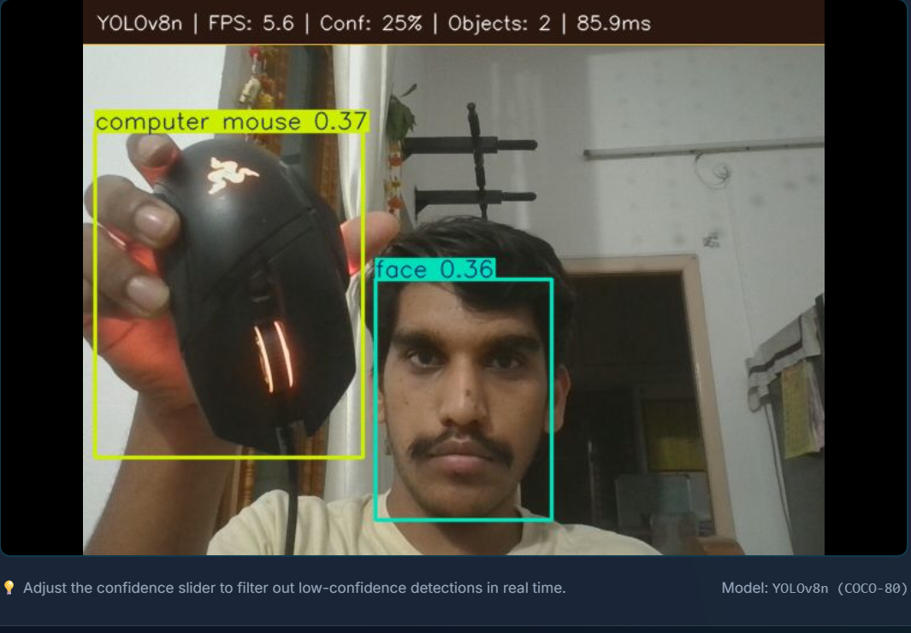
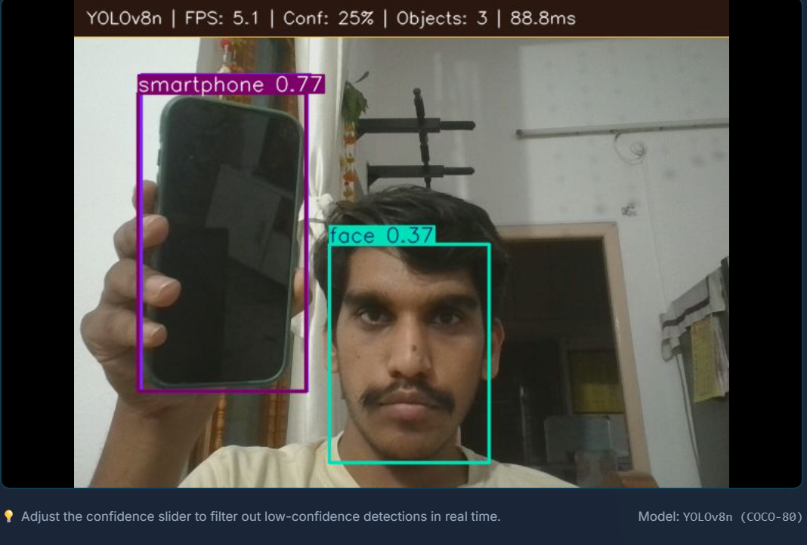
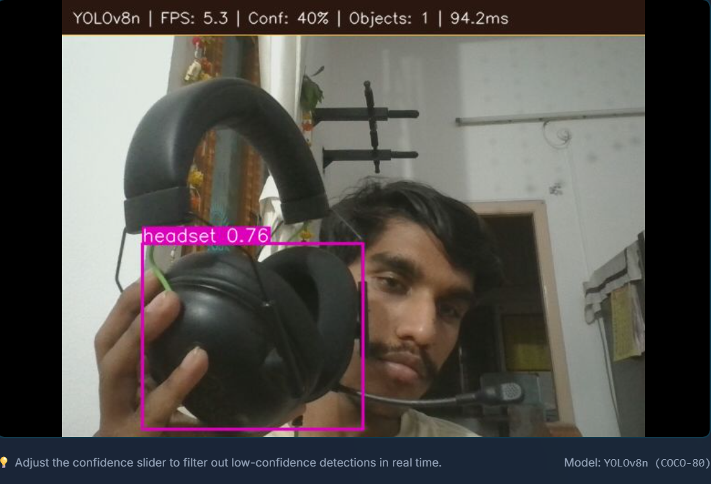
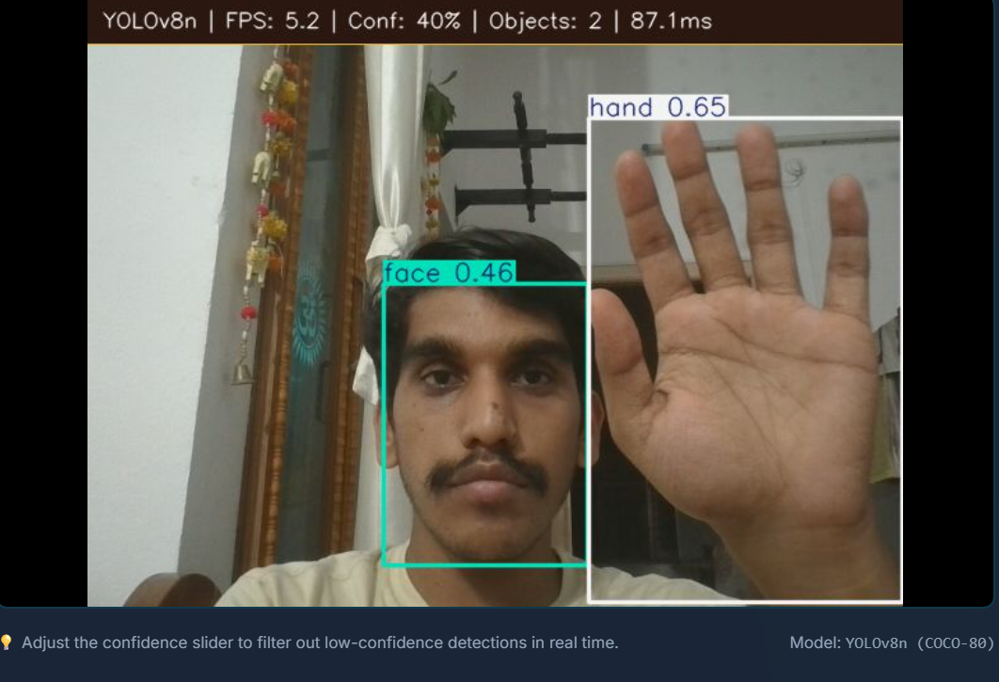
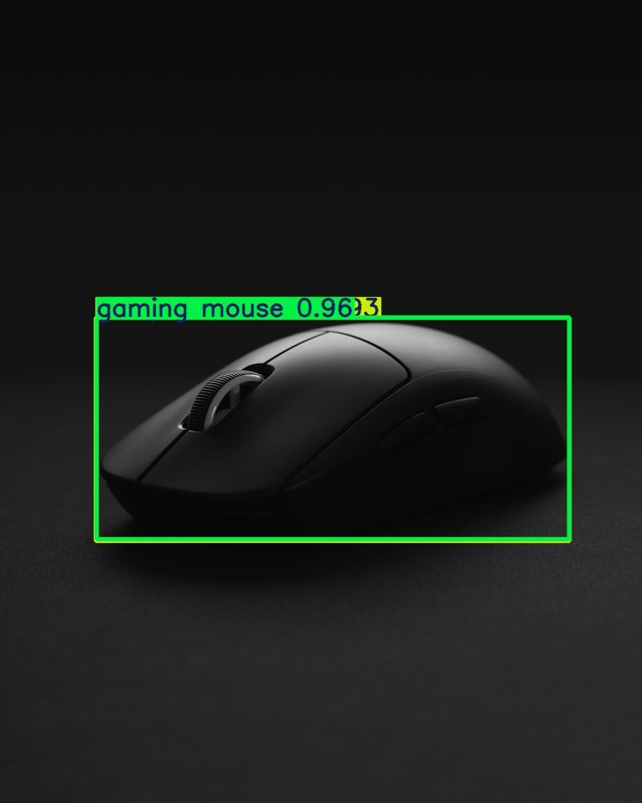
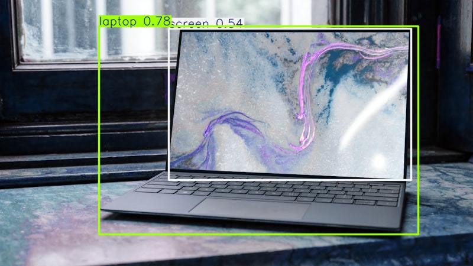
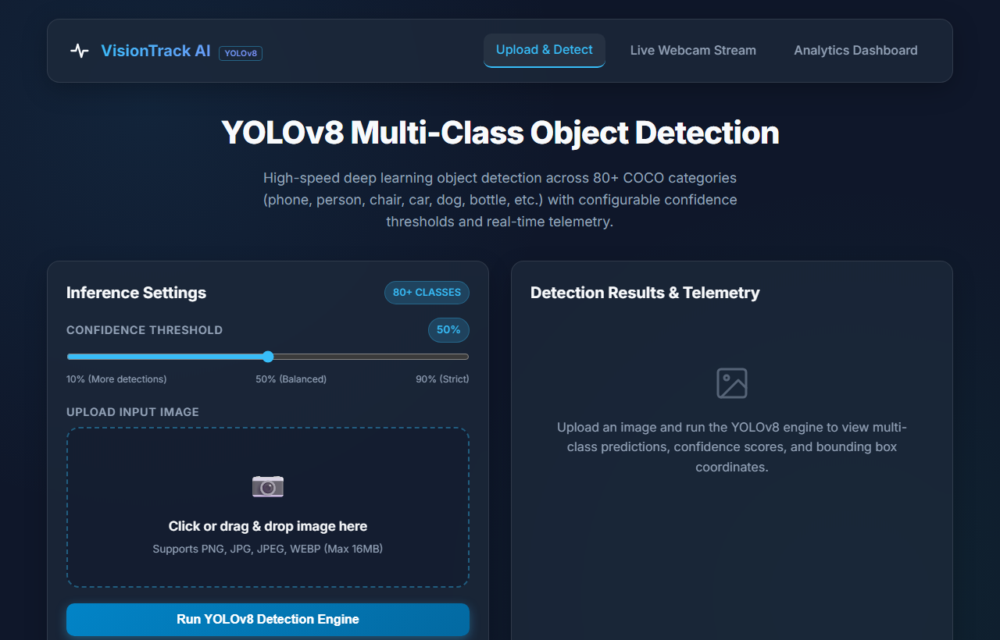
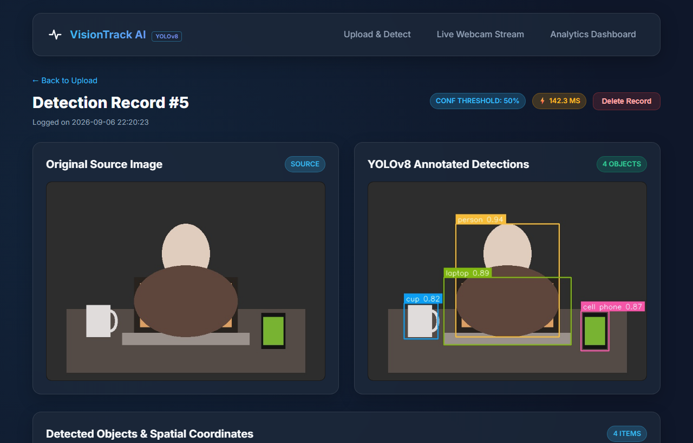
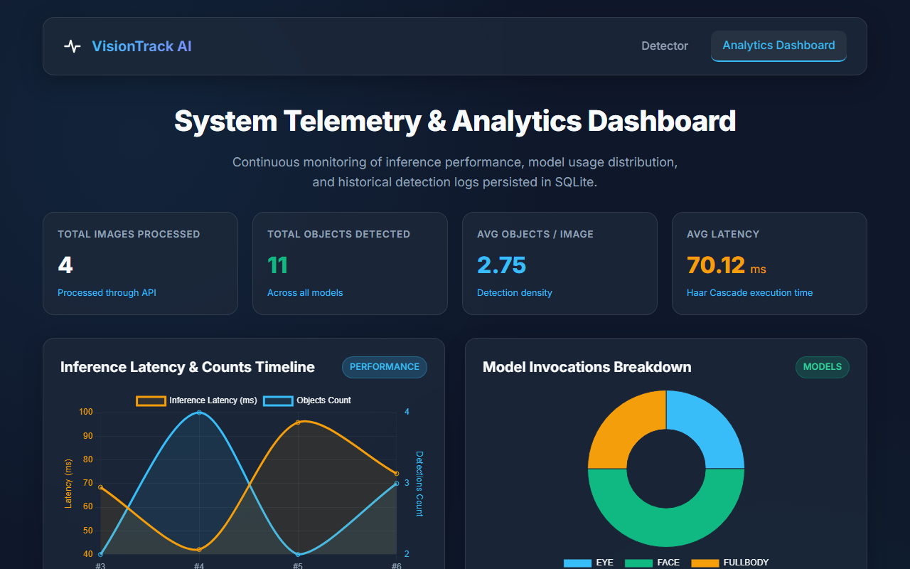

# Real-Time Object Detection & Analytics System (YOLOv8 & YOLO-World Edition)

[](https://www.python.org/)
[](https://flask.palletsprojects.com/)
[](https://github.com/ultralytics/ultralytics)
[](https://opencv.org/)
[](https://sqlite.org/)
[](https://pytest.org/)

A production-grade, modular computer vision web application and RESTful API built with **Python, YOLO-World / YOLOv8 (Ultralytics), Flask, SQLite, and modern JavaScript/CSS3**.

The system performs real-time multi-class object detection across a rich open vocabulary of everyday items, tech accessories (gaming mice, headphones, keyboards, laptops), human body parts (hands, faces, person), and living beings. It features real-time **confidence threshold tuning** (5% to 95%), SQLite logging with full CRUD operations, live MJPEG webcam streaming, and an interactive Chart.js analytics dashboard.

---

## 📸 Real-World Live Detection Screenshots

### 1. Live Webcam Object Detection in Action
> Real-time detection across live camera feeds with dynamic HUD telemetry (**FPS**, **Model**, **Objects count**, **Latency in ms**) and active bounding boxes on everyday items:

| Live Webcam Detection 1 | Live Webcam Detection 2 |
|:---:|:---:|
|  |  |

| Live Webcam Detection 3 | Live Webcam Detection 4 |
|:---:|:---:|
|  |  |

---

## 🖼️ Static Image Detection (Real-World Internet Samples)

> Multi-class inference and bounding-box localization on high-resolution real-world test scenes:

### Gaming Gear & Desk Setup Detection
| Original Real Image | YOLO Annotated Result |
|:---:|:---:|
|  |  |

### Modern Workspace & Laptop Detection
| Original Real Image | YOLO Annotated Result |
|:---:|:---:|
|  |  |

---

## 🖥️ Web Application Dashboard & Telemetry

### Main Upload Interface (with Quick Confidence Presets)
> Drag-and-drop file upload zone with interactive confidence threshold slider (5% to 95%) and one-click preset buttons for high sensitivity (Razer mouse, hands) or strict precision:


### Side-by-Side Result Inspector & Spatial Bounding Box Table
> High-resolution side-by-side inspection with coordinate metrics, confidence scores, and raw JSON export:


### Real-Time Analytics & Performance Dashboard
> Real-time system telemetry with KPI cards, Top 10 detected object classes bar chart, latency trend line charts, and SQLite history table with CRUD deletion:


---

## 🌟 Key Features

- **Open-Vocabulary & Multi-Class Architecture**: Powered by Ultralytics YOLO-World / YOLOv8 with preloaded real-world vocabulary covering:
  - 🖱️ **Gaming Gear & Tech**: `gaming mouse`, `computer mouse`, `headphones`, `headset`, `earbuds`, `keyboard`, `laptop`, `monitor`, `webcam`, `microphone`, `cell phone`, `usb cable`, etc.
  - 🖐️ **Humans & Body Parts**: `person`, `hand`, `face`, `head`, `arm`.
  - 👓 **Wearables & Everyday Items**: `watch`, `glasses`, `backpack`, `wallet`, `cup`, `water bottle`, `chair`, `desk`, `pen`, `book`, etc.
  - 🐶 **Living Beings**: `dog`, `cat`, `bird`, `potted plant`, etc.
- **Dynamic Confidence Threshold Tuning**: Interactive slider (5% to 95%) and preset buttons (`25% Sensitive`, `40% Recommended`, `75% High Precision`, `90% Strict`).
- **Real-Time Latency Telemetry**: Sub-millisecond profiling tracking inference latency (`processing_time_ms`) on every request.
- **Strict Input Validation & Security**:
  - Whitelist validation (`PNG`, `JPG`, `JPEG`, `WEBP`)
  - 16MB file payload limit (`MAX_CONTENT_LENGTH`)
  - OpenCV image decode validation (`cv2.imread`)
  - Standard HTTP status codes (`200`, `400`, `404`, `413`, `415`, `500`)
- **Full CRUD RESTful API**: Endpoints including `POST /detect`, `GET /api/history`, `GET /api/history/<id>`, and `DELETE /api/history/<id>`.
- **Relational Persistence**: SQLite storage with automatic schema generation, indexes, and JSON spatial telemetry.
- **100% Automated Pytest Coverage**: Unit tests for detection logic and API integration tests.

---

## 🛠️ Tech Stack

| Layer | Technology |
|---|---|
| **Deep Learning Engine** | Ultralytics YOLO-World / YOLOv8 (`yolov8s-worldv2.pt` / `yolov8n.pt`) |
| **Backend Framework** | Flask 3.0 (Python) |
| **Computer Vision** | OpenCV (`cv2`) & NumPy |
| **Database** | SQLite 3 (Indexed relational logging) |
| **Frontend UI** | HTML5, Modern CSS3 Glassmorphism, Vanilla JavaScript |
| **Data Visualization** | Chart.js 4.x |
| **Testing Suite** | Pytest, Requests |

---

## 🚀 Installation & Getting Started

### 1. Clone the Repository
```bash
git clone https://github.com/harshithcheripally16-ui/AI_Object_Detection_System.git
cd AI_Object_Detection_System
```

### 2. Set Up a Virtual Environment
```bash
# Windows
python -m venv venv
.\venv\Scripts\activate

# Linux / macOS
python3 -m venv venv
source venv/bin/activate
```

### 3. Install Dependencies
```bash
# Production environment
pip install -r requirements.txt

# Development / Testing environment
pip install -r requirements-dev.txt
```

### 4. Run the Application
```bash
python app.py
```
Open your browser and navigate to:
```
http://127.0.0.1:5000/
```

---

## 🧪 Running Automated Tests

Run the complete test suite using `pytest`:

```bash
pytest -v tests/
```

---

## 📄 License
This project is licensed under the MIT License.
